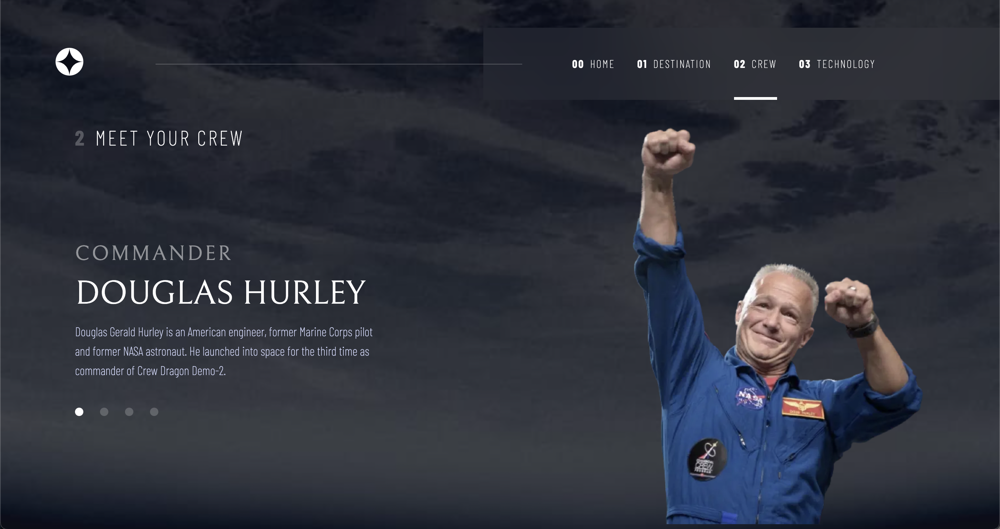
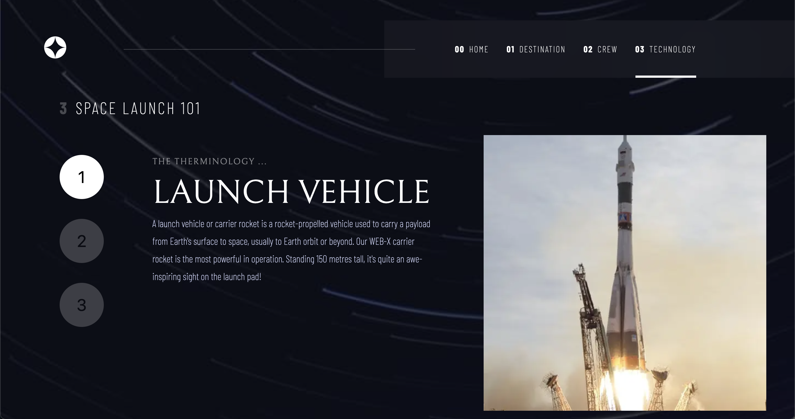

# Frontend Mentor - Space tourism website solution

This is a solution to the [Space tourism website challenge on Frontend Mentor](https://www.frontendmentor.io/challenges/space-tourism-multipage-website-gRWj1URZ3). Frontend Mentor challenges help you improve your coding skills by building realistic projects. 

## Table of contents

- [Overview](#overview)
  - [The challenge](#the-challenge)
  - [Screenshot](#screenshot)
  - [Links](#links)
- [My process](#my-process)
  - [Built with](#built-with)
  - [What I learned](#what-i-learned)
  - [Continued development](#continued-development)
- [Author](#author)

**Note: Delete this note and update the table of contents based on what sections you keep.**

## Overview
This is a application that I created to put in practice nextJS and tailwindcss. Both technologies are new for me and I see this Frontend Mentor challenge as a opportunity to improve my skills.

### The challenge

Users should be able to:

- View the optimal layout for each of the website's pages depending on their device's screen size
- See hover states for all interactive elements on the page
- View each page and be able to toggle between the tabs to see new information

### Screenshot

# Home

# Destinations

# Crew

# technology

### Links
- Live Site URL: [Space Tourism App](https://frontend-mentor-space-tourism-app.vercel.app/)

## My process

### Built with

- Mobile-first workflow
- [React](https://reactjs.org/) - JS library
- [Next.js](https://nextjs.org/) - React framework
- [Tailwindcss](https://tailwindcss.com/) - For styles

### What I learned
I learned how to create a projext using Nextjs, how to manage the routes and how to deploy to vercel.
Also, I learned how to use tailwindcss. I like the idea to use a lib to create styles just using pre generated classes, but I couldn't create a perfect pixel layout and I felt that is to complicated to create new classes for intermediate formattings.

### Continued development

I will focus to split better the components, there are some components that does not need to be duplicated.
Also, there are any unit test, I intent to create some unit tests even though there is no much complex code.

## Author

- Frontend Mentor - [@matheushahnn](https://www.frontendmentor.io/profile/matheushahnn)
